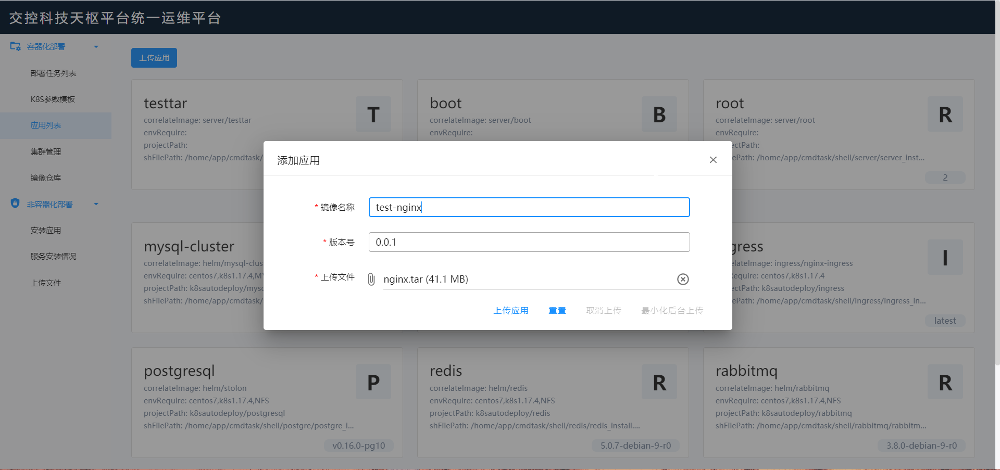
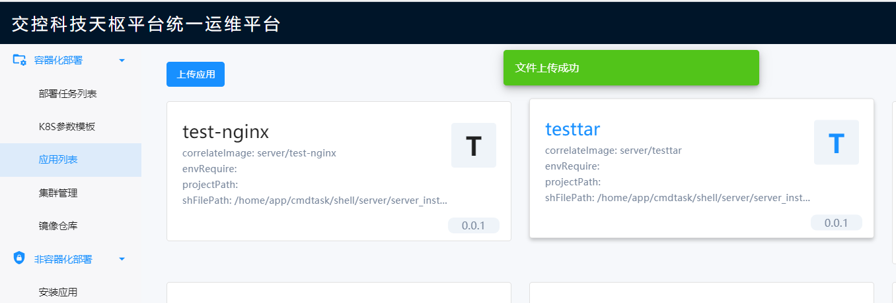
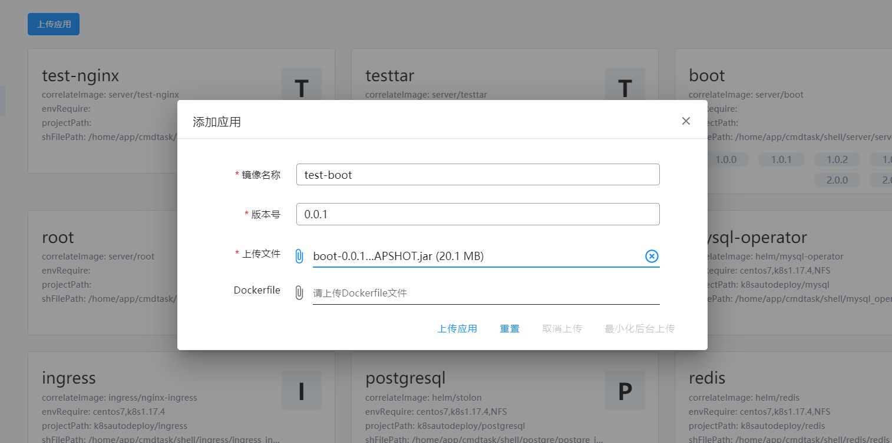
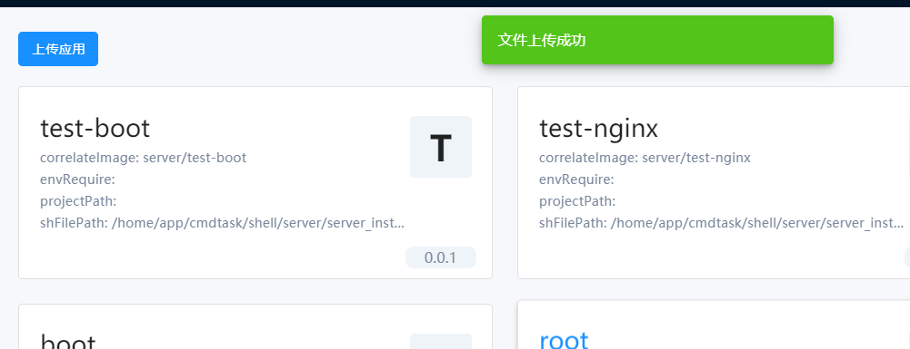
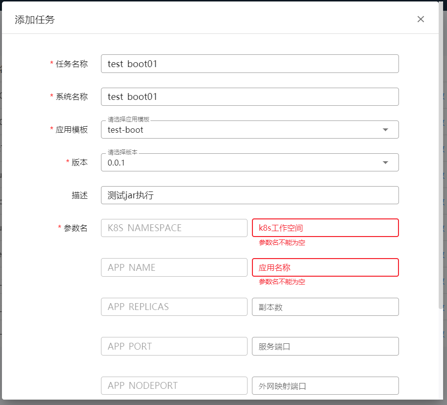

# 容器化部署文档说明

## 上传tar

**打开应用列表，点击上传应用，在弹出框中输入要上传的镜像名称、版本号，在上传文件栏选择要上传的tar包**

**点击上传应用，会出现上传进度条**

**上传成功后会弹出文件上传成功提示，在应用列表中可以看到刚刚上传的应用**

## 上传jar

**系统支持上传服务jar，打开应用列表，点击上传应用，在弹出框中输入要上传的镜像名称、版本号，在上传文件栏选择要上传的jar包。**

**当选择jar后，会增加一项dockerfile文件上传项，上传dockerfile则按照上传的dockerfile打包镜像，如不上传dockerfile，则按照通用dockerfile文件（默认使用jdk1.8）进行打包。**

## 执行

**系统对用户自行上传的服务配置了一套通用执行参数，包括k8s工作空间、应用参数、副本数、服务端口、外网映射端口、容器挂载路径、宿主机映射路径，配置正确后点击提交任务即可在k8s中正常运行。**

