# 中间件非容器部署使用手册

## 准备工作

### **将安装包放到指定路径**

**如下图（/install 文件夹）：**

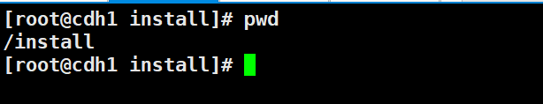

### 授予权限

~~~shell
chmod a+x -R /install/app
~~~

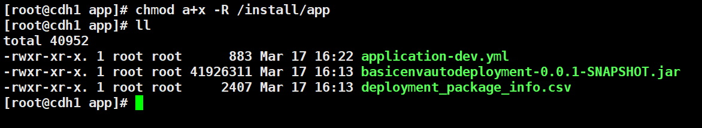

### 安装JDK

**推荐安装Oracle JDK1.8**

**服务器没有安装JDK或者版本低于1.8需要进行安装**

### 开放端口

**以22端口举例**

~~~shell
#firewall
firewall-cmd --zone=public --add-port=22/tcp --permanent
firewall-cmd --reload

#iptables
iptables -A INPUT -p tcp --dport 22 -j ACCEPT
iptables -A OUTPUT -p tcp --sport 22 -j ACCEPT
service iptables save
~~~

## 服务初始化

### 资源规划

**点击左侧边栏的【安装应用】按钮**

**填写服务器相关信息，服务器最少三台**

**按照提示填写服务器信息，点击【初始化安装】按钮**

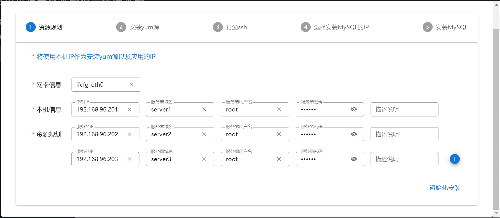

### 安装YUM源

**此步骤自动进行，耐心等待安装成功即可**

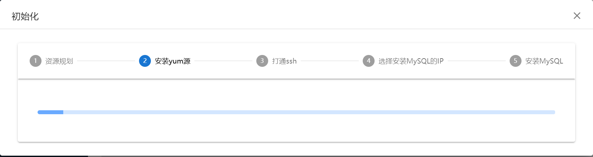

### **配置SSH免密登录**

**此步骤自动进行，耐心等待安装成功即可**

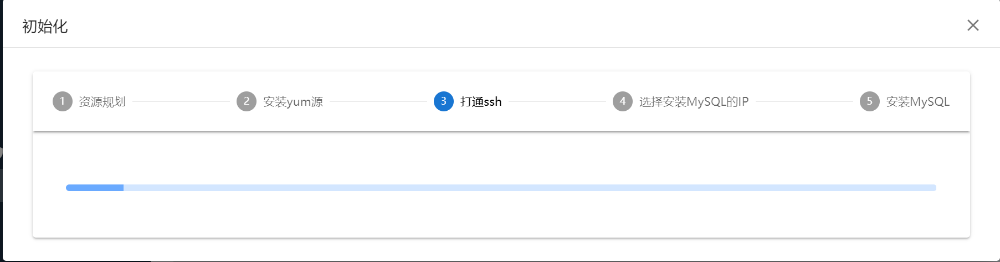

### 安装MySQL

**勾选安装的机器**

**安装两台及以上会配置MySQL集群**

**点击【安装MySQL】按钮，等待安装完成即可**

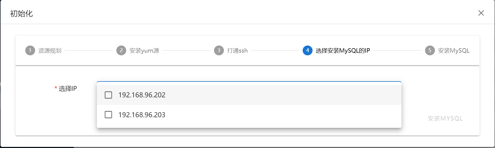

## 添加服务

### Nginx

**点击 【安装应用】 按钮，在【应用列表】中选择【Nginx】服务**

**勾选需要安装的版本，以及需要安装的服务器IP**

**选择完成后点击【开始安装】按钮，等待安装完成**

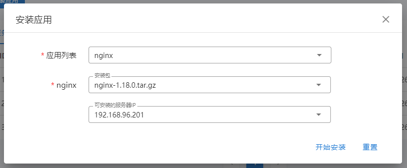

### Haproxy

**点击 【安装应用】 按钮，在【应用列表】中选择【Haproxy】服务**

**勾选需要安装的版本，需要安装的服务器IP，以及负载到的Nginx IP PORT**

**选择完成后点击【开始安装】按钮，等待安装完成**

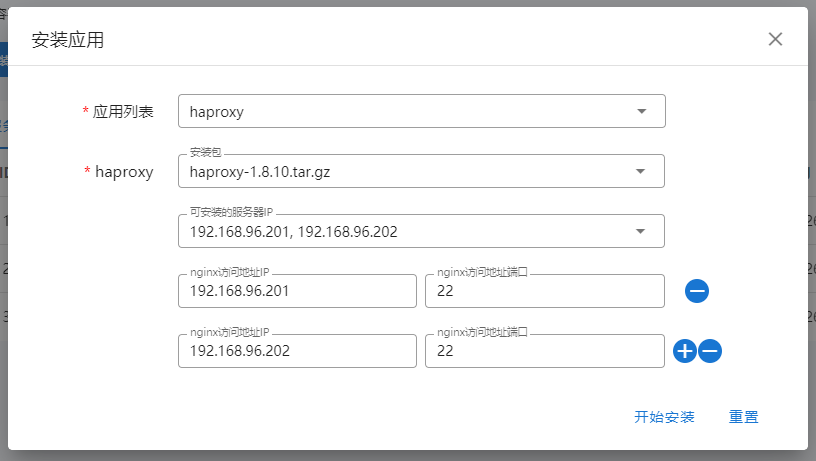

### Keepalive

**点击 【安装应用】 按钮，在【应用列表】中选择【Keepalive】服务**

**勾选需要安装的版本，需要安装的服务器IP，以及虚拟网段、网卡后缀**

**选择完成后点击【开始安装】按钮，等待安装完成**

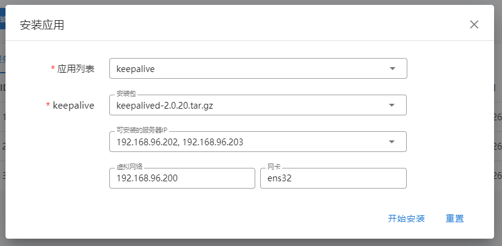

### Kafka

**点击 【安装应用】 按钮，在【应用列表】中选择【Keepalive】服务**

**勾选需要安装的版本，需要安装的服务器IP**

**选择完成后点击【开始安装】按钮，等待安装完成**

**注：选择的服务器不能少于3台**

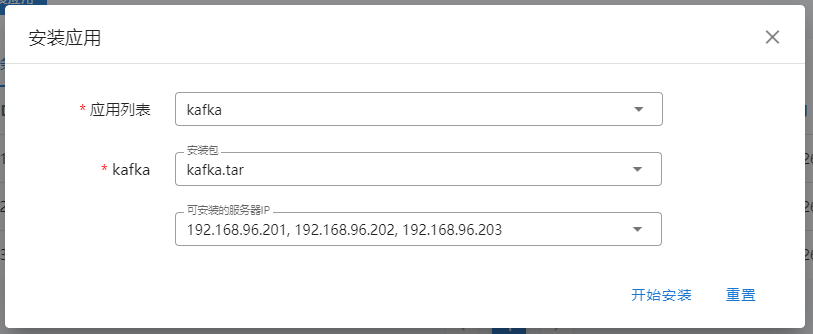

### Zookeeper

**点击 【安装应用】 按钮，在【应用列表】中选择【Zookeeper】服务**

**勾选需要安装的版本，需要安装的服务器IP**

**选择完成后点击【开始安装】按钮，等待安装完成**

**注：选择的服务器不能少于3台**

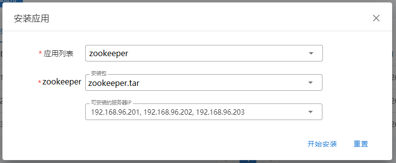

### Redis

**点击 【安装应用】 按钮，在【应用列表】中选择【Redis】服务**

**勾选需要安装的版本，需要安装的服务器IP**

**选择完成后点击【开始安装】按钮，等待安装完成**

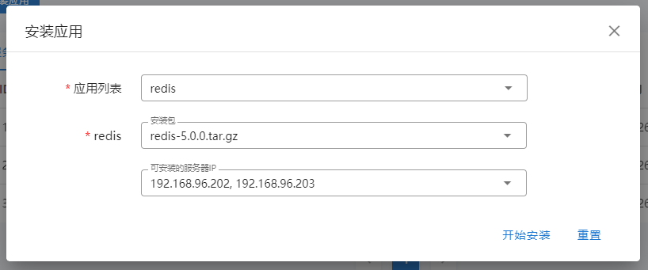

## 服务器信息

**在【安装应用】页面点击【服务器信息】按钮**

## 安装包信息

**在【安装应用】页面点击【安装包信息】按钮**

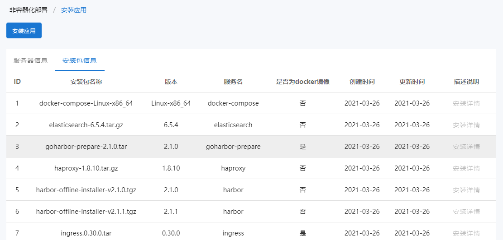

## 服务安装情况

**点击【服务安装情况】页面，进行查看**

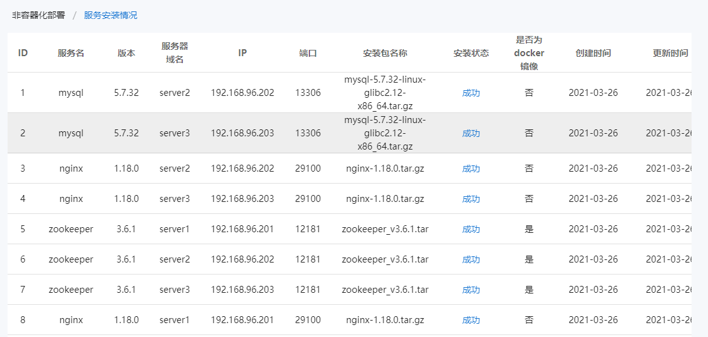

## 部署服务

### 上传服务

**在【上传文件】页面点击【上传文件】按钮，填写相关信息**

**程序运行的服务器，上传的用户，访问程序的端口，选择服务运行所需文件**

**填写完毕后，点击【开始上传】按钮，等待上传完成。**

**注：上传文件仅支持【jar】或者【tar】后缀的文件，对应【后端】/【前端】**

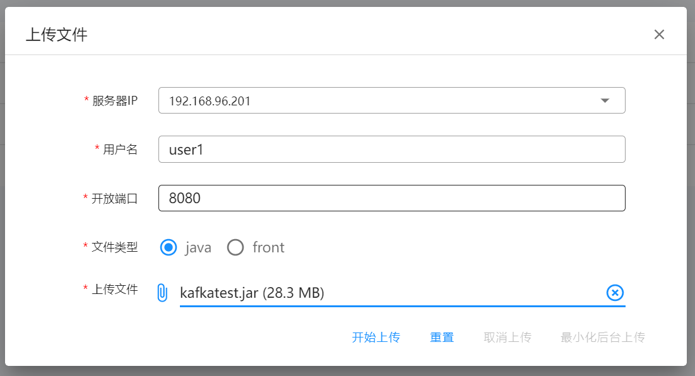

### 运行服务

**在【上传文件】页面的【操作】中点击【运行】按钮**

**注：程序未运行时，停止按钮置灰，不可使用**

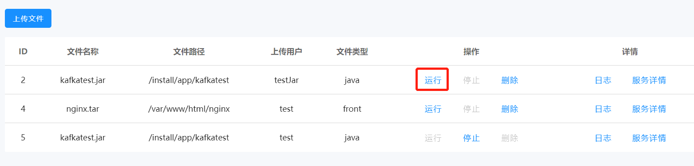

### 停止服务

**在【上传文件】页面的【操作】中点击【停止】按钮**

**注：程序运行时，运行、删除按钮置灰，不可使用**

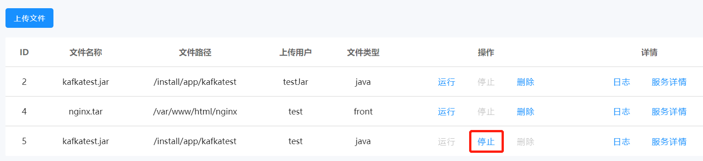

### 查看日志

**在【上传文件】页面的【详情】中点击【日志】按钮，等待弹出日志**

### 服务详情

**在【上传文件】页面的【详情】中点击【服务详情】按钮，等待弹出信息**

**弹出信息包括 该服务部署的IP，端口，以及部署时间**

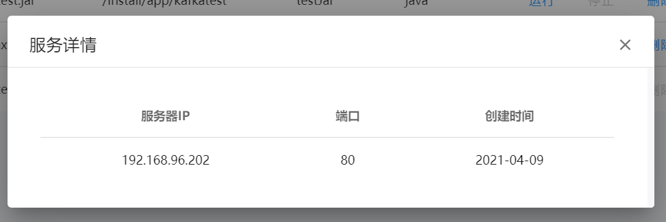

### 删除服务

**在【上传文件】页面的【操作】中点击【删除】按钮**

**注：程序只有处于未运行状态，才可以进行删除操作**

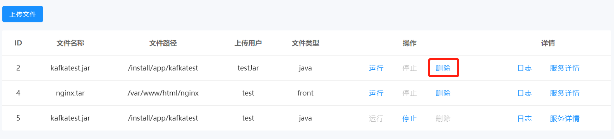